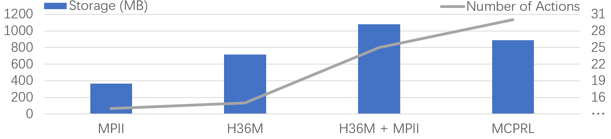
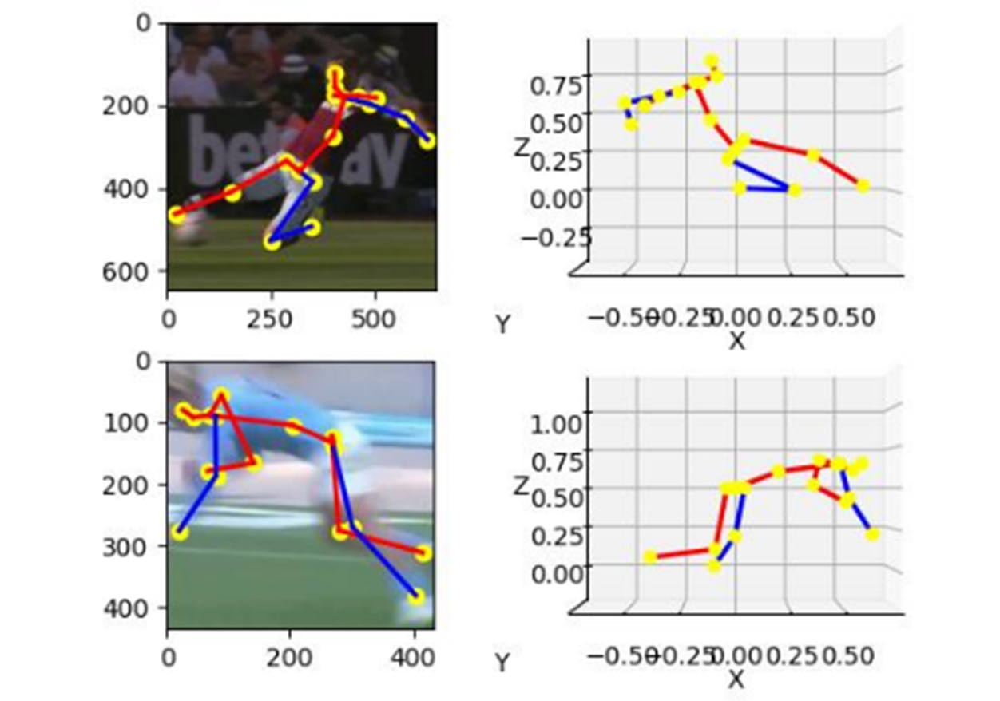
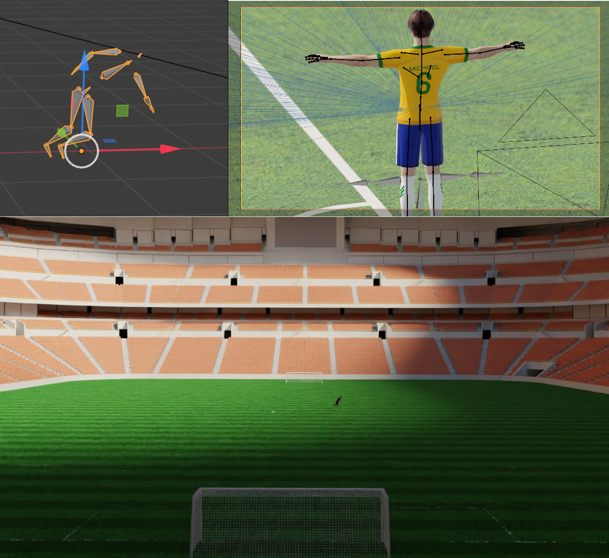

# THE ROOT ELEMENT OF HUMAN POSES IS RADIAN: MCPRL IS ALL YOU NEED [ICME 2024]

<p align="center"></p>
<p align="center"></p>

## Installation

We applied the same environmental setting with [MHFormer](https://github.com/Vegetebird/MHFormer)

- Create a conda environment: ```conda create -n mcprl python=3.9```
- Install PyTorch 1.7.1+ and Torchvision 0.8.2+ following the [official instructions](https://pytorch.org/)
- ```pip3 install -r requirements.txt```

## Generalized Radian Pruning

The example code can be find in ```./code/Generalized_Radian_Pruning.ipynb``` with detailed notes.
  
## Dataset setup

We publicised our MCPRL dataset, you can download the data from [here](https://mcprl.com/html/dataset/MCPRL.html), and put it in the ```'./dataset'``` directory of the cprresponding baseline methods.  

```bash
${ROOT}/
|-- dataset
|   |-- CAD
|   |   |-- data_train_CAD.npz
|   |   |-- data_test_CAD.npz
|   |-- MCPRL
|   |   |-- data_train_MCPRL.npz
|   |   |-- data_test_MCPRL.npz
```

## Download pretrained model

The pretrained model can be found in [here](), please download it and put it in the ```'./checkpoint/pretrained'``` directory of the cprresponding baseline methods.  

## Test the model

To test on a pretrained model on MCPRL,  
```cd``` into the corresponding baseline method:  

```bash
python main.py --test --previous_dir 'checkpoint/pretrained/'
```

## Train the model

To train on a model on MCPRL:

```bash
python main.py --batch_size 1024
```

## Additional Collision Action Dataset (CAD)

We also provide all the raw data of the additional Collision Action Dataset (CAD).  
See in the ```'./CAD_Video_Generator_Template'``` directory,  open ```CAD_00XX.blend``` using Blender 3.4+, and run ```Video_generator.py``` script on automatically generate high-quality sports videos with accurate 3d xyz labeling.

|   |  |
| ------------- | ------------- |

## Citation

If you find our work useful in your research, please consider citing:

## Acknowledgement

Our code is principally extended from Zhao et al. 's [PoseFormerV2](https://github.com/QitaoZhao/PoseFormerV2)  
We thank the authors for releasing the codes.

We select the following models as baseline methods  

- [PoseFormerV2](https://github.com/QitaoZhao/PoseFormerV2)  
- [GraphMLP](https://github.com/Vegetebird/GraphMLP)  
- [P-STMO](https://github.com/paTRICK-swk/P-STMO)  
- [VideoPose3D](https://github.com/facebookresearch/VideoPose3D)  
- [MHFormer](https://github.com/Vegetebird/MHFormer)  

## Licence

This project is licensed under the terms of the MIT license.
